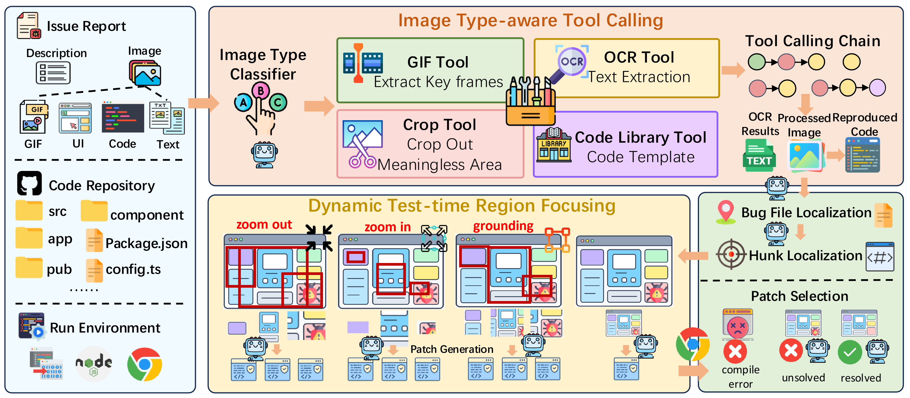

# VisualRepair: Dynamic Tool Calling and Region Focusing for Visual Software Issue Repair

## 📜 Abstract
Automated Program Repair (APR) has witnessed significant progress with the advent of Large Language Models (LLMs). However, as modern software systems increasingly expose rich graphical user interfaces, effectively leveraging visual information from bug screenshots has become essential for understanding bugs and generating accurate fixes in multimodal scenarios. Real-world issue reports frequently contain heterogeneous visual attachments including UI screenshots, IDE snapshots, GIFs, and text-centric images, each with distinct visual patterns and domain-specific semantics that impose substantial perceptual demands on MLLMs. Furthermore, bug screenshots often contain large expanses of uninformative and bug-irrelevant regions, distracting the model's attention and limiting patch diversity. 

To address these challenges, we propose **VisualRepair**, an MLLM-based framework for visual software issue repair comprising two core modules: **Image Type-aware Tool Calling (ITTC)**, which classifies input images and dynamically invokes a tailored tool-calling chain for robust visual interpretation, and **Dynamic Test-time Region Focusing (DTRF)**, which grounds multiple bug-related region candidates and refines them via an adaptive zoom-in and zoom-out strategy to improve fault localization and promote diverse patch generation. Extensive experiments on the SWE-bench Multimodal benchmark demonstrate that VisualRepair consistently outperforms state-of-the-art approaches. VisualRepair resolves **196** and **25** instances on the test and dev sets, respectively, surpassing the best baseline by **10** and **11** instances. These results highlight the effectiveness of type-aware visual understanding and region-focused localization for automated visual software issue repair. 


## 📦 Data Preparation
VisualRepair is evaluated on the SWE-bench Multimodal benchmark.To download the dataset, run:
```bash
python Data/download.py
```

## 🚀 Usage
Before running VisualRepair, please set the API credentials for your chosen backend model.
```bash
export OPENAI_API_KEY="your_openai_api_key"
export OPENAI_BASE_URL="your_openai_api_key"
export ANTHROPIC_API_KEY="your_claude_api_key"
export ANTHROPIC_BASE_URL="your_claude_base_url"
export QWEN_API_KEY="your_qwen_api_key"
export QWEN_BASE_URL="your_qwen_base_url"
```
Then run:
```bash
bash Code/run.sh
```

## 📊 Results
The experimental results of VisualRepair are provided in the `Result` directory, including generated patches and evaluation results.