# VisualRepair: Dynamic Tool Calling and Region Focusing for Visual Software Issue Repair

VisualRepair is a multimodal automated program repair framework for software issues that contain screenshots, animated images, code renderings, and other visual evidence. It combines repository context with image-aware processing to localize faulty code, generate diverse candidate patches, and validate their visual effects.

The framework introduces two core components:

- **Image Type-aware Tool Calling (ITTC)** adapts visual processing to the input. It can extract GIF keyframes, crop uninformative backgrounds, retrieve relevant documentation, generate reproduction code, and prepare repository-specific rendering environments.
- **Dynamic Test-time Region Focusing (DTRF)** identifies several issue-relevant regions in a screenshot and creates multi-scale crops. These focused views provide complementary evidence for fault localization and diverse patch generation.


## Abstract

Automated Program Repair (APR) has made substantial progress with Large Language Models (LLMs), but modern software issues increasingly include rich graphical interfaces and heterogeneous visual attachments. UI screenshots, IDE snapshots, GIFs, and text-centric images exhibit different visual structures and impose different perceptual demands on multimodal LLMs. Screenshots may also contain large areas unrelated to the defect, which can distract the model and reduce patch diversity.

VisualRepair addresses these challenges with ITTC and DTRF. ITTC dynamically selects a visual processing chain suited to the input, while DTRF grounds multiple defect-related regions and expands them at several scales. On SWE-bench Multimodal, VisualRepair resolves **196 test instances** and **25 development instances**, outperforming the strongest evaluated baseline by **10** and **11** instances, respectively.

## Method Overview

```mermaid
flowchart LR
    A["Issue report and visual attachments"] --> B["ITTC: type-aware visual processing"]
    B --> C["Optional document retrieval and reproduction code"]
    B --> D["Repository structure and source-code analysis"]
    C --> D
    D --> E["Hierarchical fault localization"]
    E --> F["DTRF: region grounding and multi-scale crops"]
    F --> G["Diverse candidate patch generation"]
    G --> H["Build and patch validation"]
    H --> I["Visual replay and before/after comparison"]
    I --> J["Patch selection and final diff"]
```



### 1. Type-aware visual processing

VisualRepair first prepares the visual evidence according to its format and repository context.

- Static images are cropped with UI-element-aware background removal when applicable.
- GIF inputs are retained and decomposed into representative keyframes.
- Code-centric screenshots can be converted into validation HTML using repository-specific templates.
- For supported web repositories, relevant documentation is retrieved and used to generate scenario reproduction code.

These operations reduce irrelevant visual content while preserving information needed to understand or replay the issue.

### 2. Hierarchical fault localization

The system progressively narrows the search space instead of sending an entire repository to the model:

1. **Repository-level localization** selects suspicious files from the project structure.
2. **Optional retrieval augmentation** expands candidates with generated keywords or RAG results.
3. **Key-file localization** ranks compressed file skeletons containing declarations, signatures, and comments.
4. **Class/function localization** identifies the most relevant program elements.
5. **Context extraction** restores source snippets around the localized elements for patch generation.

This hierarchy provides the model with detailed code only after the candidate space has been reduced.

### 3. Dynamic Test-time Region Focusing

When grounding is enabled, DTRF asks a vision-language model to locate three distinct issue-related regions in the source screenshot. Each region is expanded at multiple scales to retain both local details and surrounding context. The original screenshot and focused crops are then used as separate visual views during patch generation, increasing the diversity of candidate repairs.

### 4. Patch generation and refinement

VisualRepair combines the issue report, localized source snippets, and visual views to generate structured `SEARCH/REPLACE` edits. Candidate patches can be checked against the source tree and refined using compilation or build diagnostics. When multiple candidates are available, a dedicated selection prompt compares them for correctness, completeness, minimality, and consistency.

### 5. Visual validation

For repositories with supported replay environments, the framework applies a candidate patch, captures the patched rendering, and compares it with the original buggy rendering. A multimodal evaluator first infers the expected appearance from the issue report and then determines whether the before/after images indicate that the defect was resolved.

## Repository Layout

```text
VisualRepair-Artifact/
├── Code/                       # Main repair workflow and model interfaces
│   ├── main.py                 # Command-line entry point
│   ├── workflow.py             # Localization, generation, and validation pipeline
│   ├── multimodal_trans.py     # Document retrieval and image-to-code stages
│   └── run.sh                  # Experiment configuration and launcher
├── Data/
│   └── download.py             # Dataset, image, and repository preparation
├── Tools/
│   ├── preprocess/             # GIF extraction, UI-aware cropping, OCR, and DTRF
│   ├── screenshot/             # Repository-specific screenshot capture tools
│   └── validation/             # Validation-page construction and replay helpers
├── Result/                     # Main experimental outputs
├── supplementary_experiments/ # Additional model results
├── assets/                     # Figures used by this README
└── prompt.py                   # Reviewer-facing catalog of all framework prompts
```

## Prompt Catalog

All prompts are collected in [`prompt.py`](./prompt.py) for convenient inspection. The catalog is documentation-only and is not imported by the runtime pipeline. Each entry records:

- the stage and purpose of the prompt;
- the original implementation location;
- required textual and visual inputs;
- the system prompt and user prompt template;
- where images are inserted into the multimodal message; and
- model-specific output-format notes.

Print the complete catalog with:

```bash
python3 prompt.py
```

## Prerequisites

The artifact expects:

- Python 3 with the packages imported by `Code/` and `Tools/`;
- Git for checking out benchmark repositories;
- Node.js for browser-based screenshot capture;
- credentials for an OpenAI-compatible or Anthropic-compatible model endpoint; and
- sufficient disk space for SWE-bench Multimodal repositories and generated artifacts.

The screenshot utilities have their own Node.js package manifest under `Tools/screenshot/`.

## Data Preparation

VisualRepair is evaluated on [`princeton-nlp/SWE-bench_Multimodal`](https://huggingface.co/datasets/princeton-nlp/SWE-bench_Multimodal). The preparation script downloads issue images and checks out repositories at their benchmark base commits.

By default, `Code/run.sh` expects the prepared workspace at `../Reproduce_Scenario` relative to this repository. Run the preparation script from the parent directory so that the generated path matches that default:

```bash
cd ..
python3 VisualRepair-Artifact/Data/download.py
cd VisualRepair-Artifact
```

If GitHub API access is rate-limited, set `github_token` near the top of `Data/download.py` before running the script.

The expected structure for each benchmark instance is:

```text
Reproduce_Scenario/<split>/<project>/<instance_id>/
├── BUG/              # Buggy scenario assets or generated reproduction files
├── FIX/              # Patched scenario assets
├── IMAGE/            # Images attached to the issue report
├── PRE/              # Optional pre-repair assets
├── REPO/<repo_name>/ # Repository checked out at the benchmark base commit
└── bug_info.json
```

To use another location, set `GUIREPAIR_REPO_PATH` to the root of `Reproduce_Scenario`.

## API Configuration

Configure the endpoint used by the model selected in `Code/run.sh`.

For OpenAI-compatible models:

```bash
export OPENAI_API_KEY="your_api_key"
export OPENAI_BASE_URL="https://your-compatible-endpoint/v1"  # Optional
```

For Anthropic-compatible models:

```bash
export ANTHROPIC_API_KEY="your_api_key"
export ANTHROPIC_BASE_URL="https://your-compatible-endpoint"  # Optional
```

`CLAUDE_API_KEY` and `CLAUDE_BASE_URL` are also accepted aliases.

## Running VisualRepair

The experiment settings are grouped at the top of `Code/run.sh`. At minimum, review:

- `task`: `run` for repair generation or `val` for replay/validation;
- `base_model`: the model identifier sent to the configured endpoint;
- `dataset_split`: `dev` or `test`;
- `instance_id`: a full benchmark ID, a project selector, multiple space-separated selectors, or `all`;
- `repo_path`: the prepared `Reproduce_Scenario` root;
- `patch_generation_samples` and `ground_patch_generation_samples`: candidate counts; and
- `Patch_Select`: whether to run model-based candidate selection.

Run the configured experiment from the repository root:

```bash
bash Code/run.sh
```

Environment variables can override the most common paths and selectors without editing the script:

```bash
export GUIREPAIR_REPO_PATH="/absolute/path/to/Reproduce_Scenario"
export GUIREPAIR_INSTANCE_ID="chartjs__Chart.js-8868"
bash Code/run.sh
```

Multiple instances can be selected with a space- or comma-separated value:

```bash
export GUIREPAIR_INSTANCE_ID="PrismJS, highlightjs"
bash Code/run.sh
```

## Outputs

Outputs are written under the configured `output_dir`, grouped by dataset split and instance ID. Depending on the enabled stages, an instance directory contains:

- repository structure and localized file records;
- compressed code skeletons and contextualized source snippets;
- retrieved documents and generated reproduction code;
- original and focused images produced by preprocessing and DTRF;
- candidate `SEARCH/REPLACE` edits;
- build, screenshot, and visual-feedback records;
- token-usage accounting; and
- the final `changes.diff` patch.

Intermediate files are cached and reused when present, which makes individual stages easier to inspect and rerun.

## Results

The `Result/` directory contains the primary VisualRepair outputs for the SWE-bench Multimodal development and test sets. Results from additional model configurations are available in `supplementary_experiments/`.
